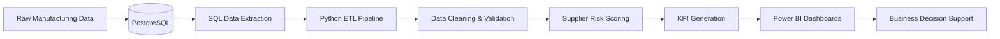
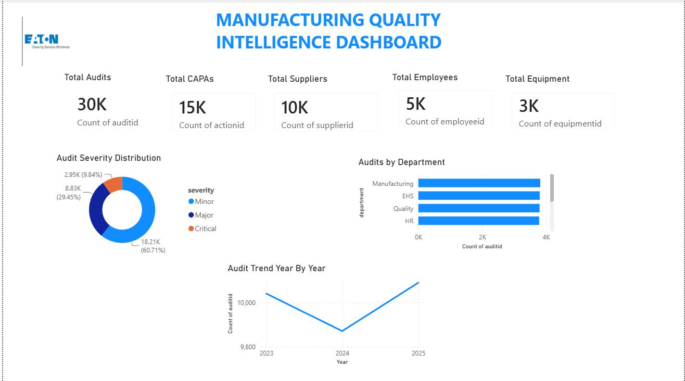
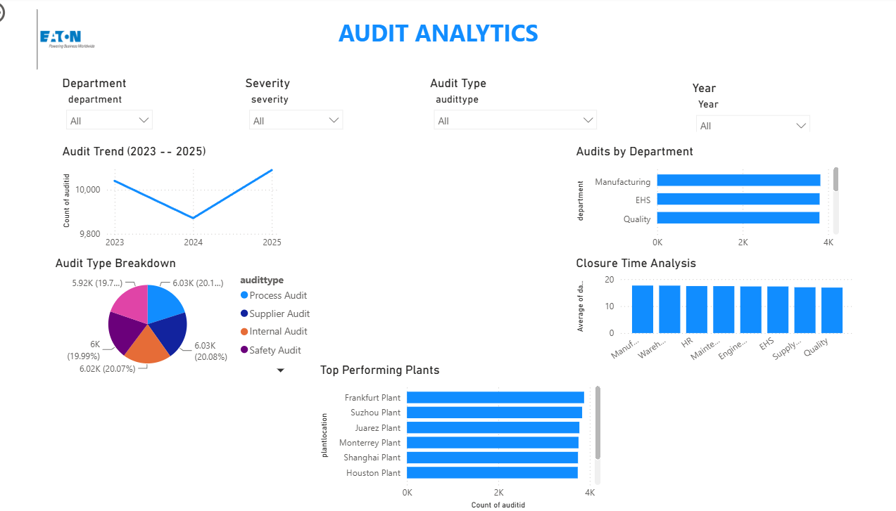
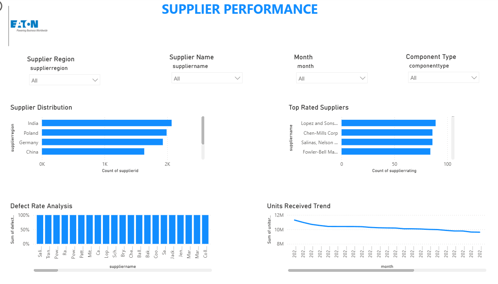
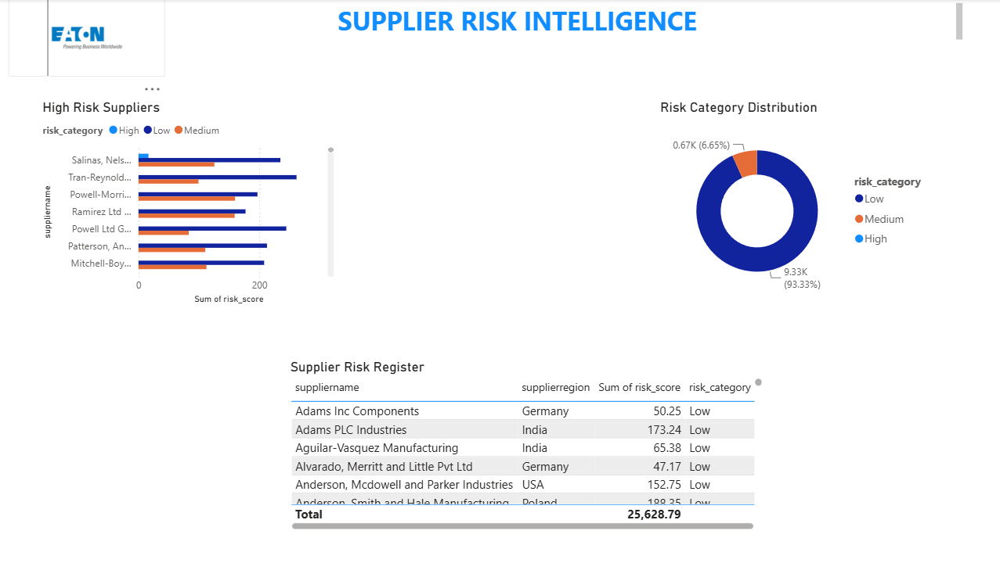

# 🏭 Manufacturing Quality Intelligence Platform

### End-to-End Manufacturing Analytics Platform using PostgreSQL, Python and Power BI

Transforming raw manufacturing data into actionable business intelligence through data engineering, supplier risk analytics and interactive dashboards.


## 📑 Table of Contents

- [Project Overview](#-project-overview)
- [Business Problem](#-business-problem)
- [Solution Architecture](#-system-architecture)
- [Technology Stack](#-technology-stack)
- [Database Schema](#-database-schema)
- [Project Workflow](#-project-workflow)
- [Dashboards](#-dashboards)
- [Business Insights](#-business-insights)
- [Repository Structure](#-repository-structure)
- [Installation](#-installation)
- [Future Improvements](#-future-improvements)

---

## 📌 Project Overview

This project simulates a real-world enterprise Manufacturing Quality Management System used to monitor audits, supplier performance and operational risks.

The platform integrates PostgreSQL, Python and Power BI into a single analytics workflow.

---

---

## 🎯 Business Problem

Manufacturing organizations generate large volumes of operational, supplier, and quality data every day. However, this data is often stored across multiple systems, making it difficult to identify quality issues, monitor supplier performance, and support timely decision-making.

Without a centralized analytics platform, organizations face challenges such as:

- Limited visibility into manufacturing quality KPIs
- Difficulty identifying high-risk suppliers
- Delayed detection of recurring defects and audit findings
- Time-consuming manual reporting processes
- Inefficient tracking of audit performance and corrective actions
- Increased operational and compliance risks

This project addresses these challenges by integrating PostgreSQL, Python, and Power BI into a unified analytics workflow that automates data processing, generates supplier risk insights, and delivers interactive dashboards for data-driven decision-making.

---

## ⚙️ Technology Stack

| Category | Technology |
|----------|------------|
| Database | PostgreSQL |
| Programming Language | Python |
| SQL | PostgreSQL SQL |
| Data Processing | Pandas |
| ORM | SQLAlchemy |
| Business Intelligence | Power BI |
| Data Visualization | Power BI |
| ETL Pipeline | Python |
| Dashboard Language | DAX |
| Version Control | Git & GitHub |

---

## 🔄 Project Workflow



## 🗄 Database Schema

Main Tables

- suppliers
- audits
- inspections
- quality_metrics
- production_batches
- supplier_risk


## 🏗️ System Architecture

PostgreSQL Database

↓

Python Data Processing

↓

Risk Analysis Engine

↓

Business Insight Generation

↓

Power BI Interactive Dashboards

↓

Business Decision Support

---

## 📊 Dashboards

### Executive Overview

* Manufacturing KPI monitoring
* Audit severity analysis
* Department performance tracking


## 📈 Business Insights

The dashboards provide insights such as:

- Top 10 highest-risk suppliers
- Plants with the most audit findings
- Departments requiring corrective actions
- Monthly manufacturing quality trends
- Supplier defect distribution
- Audit closure performance
- 

### Audit Analytics

* Audit trend analysis
* Plant performance analysis
* Closure time analysis

### Supplier Performance

* Supplier distribution analysis
* Defect rate analysis
* Units received trend analysis

### Supplier Risk Intelligence

* Supplier risk scoring
* High-risk supplier identification
* Risk category distribution
* Supplier risk register

---

## 🚀 Project Highlights

* Built 4 interactive Power BI dashboards
* Integrated PostgreSQL with Python automation
* Developed a supplier risk scoring engine
* Automated business insight generation
* Implemented data quality validation pipelines
* Built an end-to-end analytics workflow


## 💼 Business Value Delivered

This platform enables organizations to:

- Identify high-risk suppliers
- Monitor manufacturing defects
- Improve supplier performance
- Reduce operational risk
- Generate automated business insights
- Support data-driven decision making

---

---

---

## 📊 Dataset Information

The platform uses a simulated manufacturing quality dataset designed to replicate real-world manufacturing operations.

The dataset includes information on:

- Supplier details
- Manufacturing audits
- Production batches
- Quality metrics
- Defect reports
- Supplier risk assessments

**Purpose:** Educational and portfolio demonstration.

---

## 🚀 Installation

### 1. Clone the Repository

```bash
git clone https://github.com/roshaaann30/manufacturing-quality-intelligence-platform.git

cd manufacturing-quality-intelligence-platform
```

### 2. Install Python Dependencies

```bash
pip install -r requirements.txt
```

### 3. Set Up PostgreSQL

- Install PostgreSQL (version 14 or later recommended)
- Create a new database.
- Execute the SQL scripts located in the `SQL/` directory to create the required tables and populate the database.

### 4. Configure Database Connection

Update your PostgreSQL credentials in the Python configuration file.

Example:

```python
DB_HOST = "localhost"
DB_PORT = "5432"
DB_NAME = "manufacturing_quality"
DB_USER = "postgres"
DB_PASSWORD = "your_password"
```

### 5. Run the Python Pipeline

```bash
python python/main.py
```

This will:
- Extract data from PostgreSQL
- Perform data cleaning and validation
- Generate supplier risk analytics
- Export processed datasets for reporting

### 6. Open the Power BI Dashboard

Open the `.pbix` file located in the `powerbi/` folder using Microsoft Power BI Desktop.

---

## ✅ Project Outputs

After successful execution, the project generates:

- Cleaned manufacturing datasets
- Supplier risk analytics
- KPI reports
- Interactive Power BI dashboards
- Business insights for decision support
  

## 🛠 Skills Demonstrated

- PostgreSQL
- SQL
- Python
- Pandas
- SQLAlchemy
- Data Cleaning
- Data Validation
- Data Analysis
- Risk Analytics
- Business Intelligence
- Data Visualization
- Power BI
- Dashboard Development
- KPI Monitoring
- DAX
- Data Integration
- ETL Pipeline


## 📂 Repository Structure

```text
outputs/
powerbi/
python/
SQL/
screenshots/
README.md
```

---

---

## 🔮 Future Improvements

Future enhancements planned for the platform include:

- Machine Learning–based defect prediction
- Real-time manufacturing data streaming
- Automated report scheduling
- REST API integration
- Predictive supplier risk analytics
- Cloud deployment using Microsoft Azure or AWS
- Role-based dashboard access
- Email notifications for high-risk suppliers

---

## 📸 Dashboard Preview

### Executive Overview



### Audit Analytics



### Supplier Performance



### Supplier Risk Intelligence


